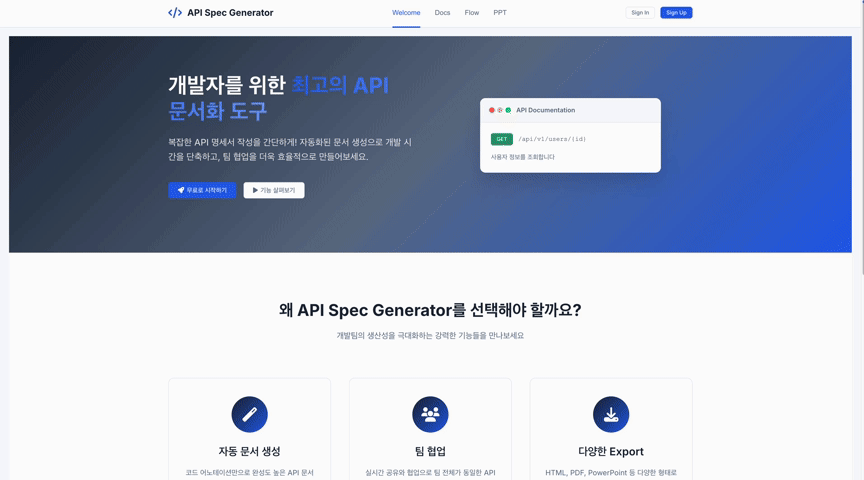
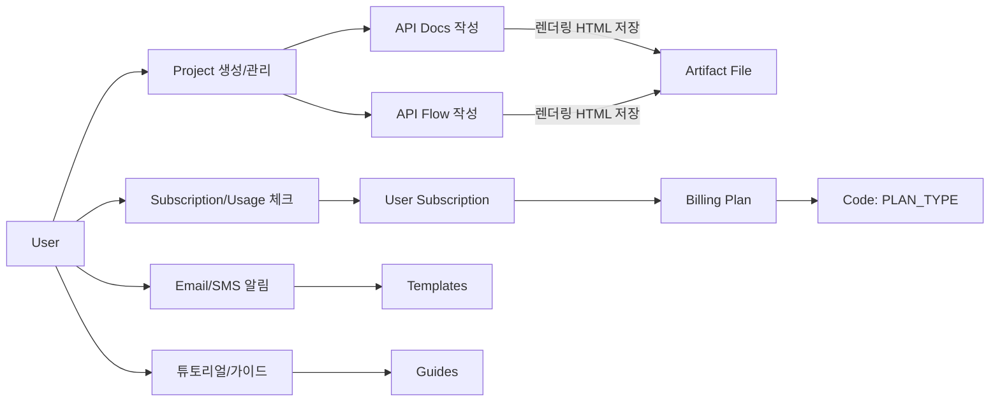
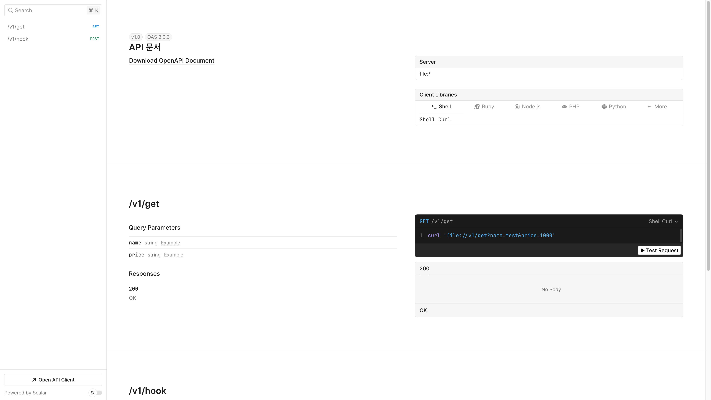
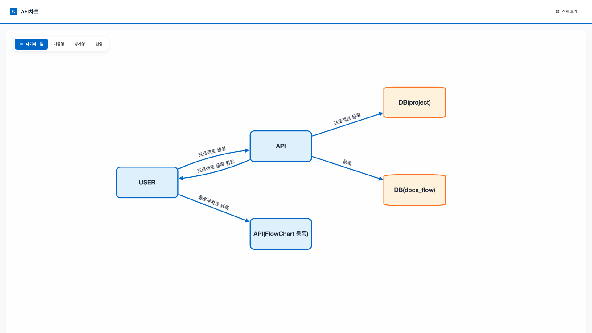

# Artifact

## 프로젝트 개요
- Artifact는 프로젝트 단위로 API 흐름도와 API 명세서를 작성·관리할 수 있는 개발자 산출물 자동화 서비스입니다.
- 산출물 작성 과정에서 반복되는 입력을 최소화하고, Scalar.js SDK를 이용한 문서 미리보기/다운로드로 작업 효율을 높입니다.
- Spring Boot 백엔드가 프로젝트·문서 CRUD와 파일 저장을 책임지고, Thymeleaf 기반 UI가 Scalar 컨테이너 및 동적 폼을 렌더링합니다.

## 주요 도메인
- Users : 로그인/프로필/권한 관리
- Project : 프로젝트 단위 관리, 버전 관리
- API Docs :프로젝트별 API 명세서 저장 (JSON 구조로 파싱 가능한 엔드포인트 저장)
- API Flow : API 흐름도(flowchart) 저장  Node·Edge 기반 데이터 구조
- Artifact File : 사용자별 문서/HTML 파일 저장소 ,API 문서 및 플로우의 렌더링 결과 저장
- Billing / Subscription : 플랜(무료/기본), 사용량 제한, 결제 주기 관리
- Templates : 이메일 인증/플랜 변경 요청 등 HTML 템플릿 관리

## 주요 기능
- **API 명세 생성 및 편집**: `/project/artifact/docs/{idx}`에서 Scalar UI와 연동된 폼으로 요청/응답 스펙을 구성하고 `DocsService`를 통해 영속화합니다.
- **API 흐름도 관리**: Flowchart 작성 데이터와 SVG/HTML 산출물을 `FlowService`·`FlowChartGenerator`가 처리하여 프로젝트별 플로우를 버전 관리합니다.
- **자동 파일 생성**: `ApiDocsGenerator`가 OpenAPI(JSON)와 Scalar 스크립트를 인라인으로 담은 HTML을 빌드하고 `ArtifactFile` 엔티티에 메타데이터를 기록합니다.
- **프로젝트 대시보드**: `ProjectController`와 `DashboardService`가 사용자별 프로젝트, 템플릿 가이드, 사용량 안내를 하나의 화면에 제공합니다.
- **인증 및 할당량 관리**: Spring Security, OAuth2 클라이언트, `QuotaService`로 사용자별 다운로드 제한과 접근 제어를 적용합니다.

## 시스템 구성 및 API 문서화 워크플로
1. 사용자가 프로젝트를 생성하면 `ProjectService`가 `project`·`api_docs_document` 초기 레코드를 생성합니다.
2. `docs/index.html` 템플릿이 Scalar 컨테이너와 동적 요청 빌더를 렌더링하고, `docs/index.js`가 입력 필드를 파라미터 유형(path, query, body 등)에 맞춰 자동 구성합니다.
3. 저장 시 `DocsService.saveDocs`가 엔드포인트 구조를 정규화해 JSON으로 직렬화 후 `api_docs_document.endpoints` 필드에 저장합니다.
4. 문서 다운로드 요청(`/api/generate/docs-url`)은 `ApiDocsGenerator`가 OpenAPI 스펙을 계산하고, Scalar API Reference 스크립트를 삽입한 HTML 파일을 `src/main/resources/static/artifact/{user}/docs/{docsIdx}` 경로에 생성합니다.
5. 생성된 파일은 `ArtifactFile`로 추적되고, 사용자 대시보드 및 프로젝트 상세에서 즉시 접근할 수 있습니다.

## 기술 스택
- **백엔드**: Spring Boot 3.5, Spring MVC, Spring Security(OAuth2 Client), Spring Data JPA, Spring Mail, Spring Data Redis, Lombok
- **프런트엔드**: Thymeleaf, Vanilla JS, Scalar.js API Reference, jQuery 3.7, SweetAlert2, NProgress
- **스토리지**: MariaDB(주요 테이블), Redis(세션/쿼터), 로컬 파일 시스템(산출물 HTML/이미지)
- **빌드/테스트**: Gradle 8, JUnit 5, Spring Boot DevTools

## 주요 디렉터리
- `src/main/java/com/gunho/artifact/controller/ArtifactController.java` – API 문서/흐름 CRUD 엔드포인트
- `src/main/java/com/gunho/artifact/service/DocsService.java` – Scalar 포맷 정규화 및 저장 로직
- `src/main/java/com/gunho/artifact/service/ApiDocsGenerator.java` – OpenAPI/Scalar HTML 산출물 생성기
- `src/main/resources/templates/project/artifact/docs/index.html` – Scalar 컨테이너와 동적 폼 템플릿
- `src/main/resources/static/js/pages/project/artifact/docs/index.js` – 요청 빌더 UI 및 미리보기/다운로드 제어
- `src/main/resources/static/artifact/` – 사용자별로 생성된 문서·흐름 HTML 아카이브 경로

## 테이블 관계 개요
| 테이블 | 설명 | 주요 관계 |
| --- | --- | --- |
| `users` | 서비스 계정, OAuth2 정보, 인증 타입 보관 | 1:N → `project`, 1:N → `artifact_file`
| `project` | 사용자 단위 프로젝트 메타데이터 | N:1 ← `users`, 1:N → `api_docs_document`, 1:N → `api_docs_flow`
| `api_docs_document` | API 명세서 제목/버전 및 엔드포인트 JSON | N:1 ← `project`, 1:1 → `artifact_file`
| `api_docs_flow` | Flowchart 화면 정보(layout/theme/flowData) | N:1 ← `project`, 1:1 → `artifact_file`
| `artifact_file` | 실제 HTML/SVG 등 산출물 파일 메타정보 | N:1 ← `users`, 1:1 ← `api_docs_document`, 1:1 ← `api_docs_flow`

## 다이어그램

## 완성본
### - API 명세서

### - API 플로우차트
